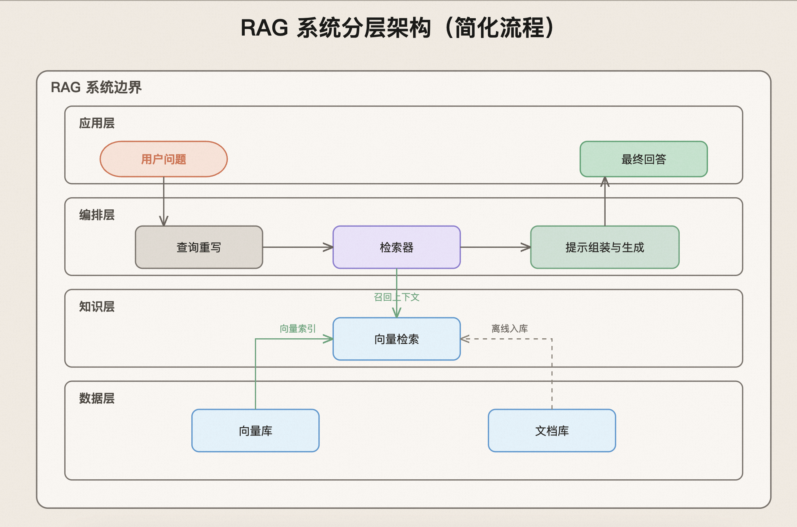

# anthropic-svg

一个 AI 编码助手技能，用于生成具有 [Anthropic 技术博客](https://www.anthropic.com/research) 视觉语言风格的编辑型图表，简洁、温暖，直接输出为 `.svg` 文件。

## 输出样例



## 它的作用

给 AI 一段对任意流程、系统或概念的描述。这个技能会：

1. 分析请求并识别合适的可视化模式
2. 先写出一个 `DiagramSpec`——在处理 SVG 之前制定的结构化方案
3. 生成完整且带样式的 SVG XML
4. 将其保存为 `.svg` 文件，并自动打开

**输出格式**：`.svg` 文件，可直接在浏览器或系统图片查看器中查看。使用 `viewBox` 实现自适应缩放，无需固定尺寸。

## 视觉风格

Anthropic 博客图表风格由几个关键原则定义：

* **温暖的画布** —— 背景色为 `#F2EFE8`，不是纯白
* **颜色用于传达含义，不是装饰** —— 每种语义角色（用户输入、错误状态、决策等）都有专属的填充色/描边色组合
* **开放式 V 形箭头** —— 这是最具辨识度的元素；通过 SVG `<marker>` + `<polyline>` 实现，绝不使用实心三角箭头
* **L/Z 形正交连接线** —— 干净、规整的折线路由，通过 `<path>` 手动计算拐点
* **外边框框架** —— 每张图都包裹在一个细线条的圆角矩形中，呈现海报般的完成感
* **大型编辑风格标题** —— 加粗、深色、水平居中
* **无阴影、无渐变、无高饱和色彩** —— 对比克制，层级主要依靠字体排版与留白来呈现

## 图表模式

该技能会根据图表需要表达的论点，从 10 种模式中选择最合适的一种：

| 模式 | 适用场景 |
|---|---|
| **线性工作流（Linear Workflow）** | 顺序步骤，一个环节引出下一个环节 |
| **反馈循环工作流（Feedback Loop Workflow）** | 重试、迭代、评估闭环 |
| **分支工作流 / 决策树（Branch Workflow / Decision Tree）** | 分支逻辑、路由、审批关卡 |
| **并行发散 / 汇聚（Parallel Fan-out / Fan-in）** | 并发执行者、结果聚合 |
| **分屏对比（Split Comparison）** | 前后对比、两种方案并排展示 |
| **分组式架构（Grouped Architecture）** | 系统边界、组件、包含关系 |
| **分层堆栈（Layered Stack）** | 层级关系、抽象层、依赖关系 |
| **中心辐射（Hub-and-Spoke）** | 一个核心概念及其支撑性想法 |
| **维恩 / 重叠（Venn / Overlap）** | 共享归属、领域汇合（限 2-3 圆） |
| **注释标注（Callout Annotation）** | 用于解释主图的补充说明 |

这些模式可以组合使用（例如"分组式架构 + 注释标注"），但始终必须有一个主模式。

## 语义化颜色系统

颜色的分配依据是**语义角色**，不是审美装饰。这种映射在所有图表中都保持一致：

| 角色 | 填充色 | 描边色 |
|---|---|---|
| 主要 / 中性 | #E6E2DA | #8C867F |
| 次要 / 上下文（文件、工具、文档） | #EAF4FB | #6FA8D6 |
| 第三层 / 控制（路由、记忆、编排） | #EEEAF9 | #9A90D6 |
| 起始 / 触发（用户输入、外部触发） | #F8E9E1 | #D88966 |
| 结束 / 成功 | #CFE8D7 | #71AE88 |
| 警告 / 重置（重试、中断） | #F3E4DA | #C88E6A |
| 决策（分支、关卡、审批） | #E6D7B4 | #BFA777 |
| AI / LLM（模型调用、代理工作者） | #D7E6DC | #7FB08F |
| 非活动 / 已禁用 | #EFECE6 | #B4AEA6 |
| 错误 | #F8DFDA | #D96B63 |

读者无需先阅读标签，仅凭颜色就能一眼判断结构角色。

## 如何使用

只需要用自然语言描述你想要可视化的内容即可。该技能会在如下请求中自动触发：

* "画一个 agent 循环的示意图"
* "创建一个展示 RAG 检索工作原理的流程图"
* "把上下文工程的前后对比可视化出来"
* "为这个系统制作一张架构图"
* "画一张流程图，展示 agent 的工作原理"

不需要任何特殊语法。该技能同时支持英文和中文——图中的标签会自动匹配你所使用的语言。

### 示例提示词

```text
画一张图，展示 LLM agent 如何使用工具：模型接收用户提示，
判断是否需要调用工具，执行工具，然后利用结果生成回复。
```

```text
创建一张对比图：左侧是一个朴素的 RAG 流水线；
右侧是一个加入重排序和查询扩展的上下文工程版本。
```

```text
画一张架构图，展示 multi-agent 系统中 planner、worker 和 verifier 的关系。
```

## 文件结构

```text
anthropic-svg/
├── SKILL.md                      # 主技能提示文件（工作流、SVG 模板、质量检查清单）
├── references/
│   ├── color-palette.md          # 所有颜色、字体、几何参数的唯一事实来源
│   ├── pattern-library.md        # 10 种图表模式，包含布局规则与反模式
│   └── connector-routing.md      # 连线路由规则（防重叠、垂直进出、跨桥）
└── README.md                     # 本文件
```

**`SKILL.md`** —— 技能的入口文件。定义了五步工作流、所有 SVG 模板代码、布局规则，以及生成前的质量检查清单。

**`references/color-palette.md`** —— 品牌风格参考文件。包含全部颜色标记、语义映射规则、容器规范、连接线规范和字体层级。若要在不改动工作流逻辑的前提下，将该技能适配为另一种视觉风格，可编辑此文件。

**`references/pattern-library.md`** —— 结构参考文件。定义了每种模式的适用场景、对应的 SVG 布局规则、应避免的反模式，以及模式组合规则。

**`references/connector-routing.md`** —— 连线路由参考文件。包含 4 条防重叠规则（端口选择、平行偏移、交叉跨桥、垂直进出）和 5 种连线形状的 SVG `<path>` 模板。

## 与 anthropic-diagram 的区别

| | anthropic-diagram | anthropic-svg |
|---|---|---|
| 输出格式 | `.drawio`（draw.io XML） | `.svg`（原生 SVG） |
| 依赖 | 需要安装 draw.io Desktop | 无需额外软件 |
| 连线路由 | draw.io 自动正交路由 | 手动 L/Z 形 path 路由 |
| 可编辑性 | 可在 draw.io 中拖拽编辑 | 最终输出，非交互编辑格式 |
| 画布尺寸 | 固定像素尺寸 | viewBox 自适应缩放 |
| 图表模式 | 12 种 | 10 种（去掉泳道时序图和编辑型图表） |
| 适用工具 | Claude Code | 任何 AI 编码工具 |

## 设计理念

> 一张好的图表不应只是展示信息，它应让其所表达的观点一目了然。

这个技能建立在三个理念之上：

1. **先模式，后像素** —— 先选择正确的结构模式，再处理样式
2. **语义化颜色** —— 每一种颜色选择都在传达含义，因此颜色本身就是信息
3. **克制是一种质量信号** —— 不用阴影、不用渐变、不过度装饰；平静、留白的风格比繁杂的设计更显可信

## 许可证

MIT
